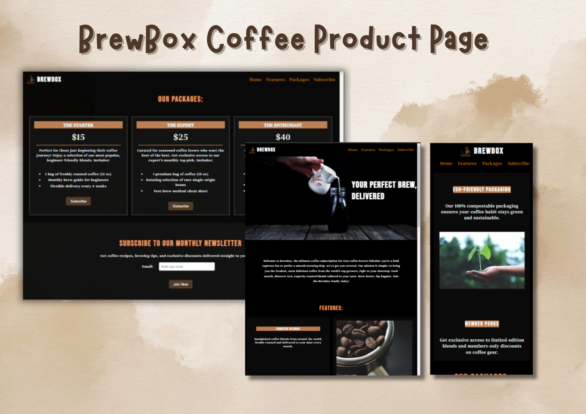

# Product_Landing_Page

## Table of contents

- [Overview](#overview)
  - [The challenge](#the-challenge)
  - [Screenshot](#screenshot)
  - [Links](#links)
- [My process](#my-process)
  - [Built with](#built-with)
  - [What I learned](#what-i-learned)

## Overview

This project is a responsive Product Landing Page built as part of a web development learning challenge for Free Code Camp. The goal was to create a visually appealing and functional landing page that meets specific user stories and works well across various screen sizes.

### The challenge

The challenge was to test my knowledge on adding the following features:

- Responsive Navbar: A navigation bar with links that scroll smoothly to different sections of the page.
- Hero Section with Video: An engaging hero section featuring a promotional video.
- Product Description Section: Detailed information about the product, including benefits and features.
- Pricing Section: A clear and organized pricing section with subscription options.
- Call to Action: A subscription form with input fields for name, email, and a submit button.
- Footer: A footer with relevant links and information..

### Screenshot

### Links

- Solution URL: https://github.com/Jud1th1/Product_Landing_Page
- Live Site URL: https://brewboxfcc.netlify.app/

## My process

1. **Conceptualization**: I began by defining the core features and layout of the Product Landing Page, aiming to create a user-friendly and visually appealing interface that effectively showcases the product.

2. **Design and Styling**: Developed a clean and responsive design using CSS3, ensuring compatibility across various devices and screen sizes. Focused on creating an intuitive navigation experience for users.

3. **Frontend Development**: Implemented the structure using HTML5, ensuring semantic markup for better accessibility and SEO. Enhanced interactivity with JavaScript where necessary.

4. **Testing and Debugging**: Conducted thorough testing across multiple browsers and devices to identify and fix any issues related to layout, responsiveness, and functionality.

5. **Final Adjustments**: Made final tweaks to the design and codebase based on feedback and testing results, ensuring a polished and professional end product.

### Built with

- HTML
- Flexbox
- CSS
- Mobile workflow

### What I learned

Throughout the development of the BrewBox webpage, I encountered a few issues that I had to rework to solve.

- **Navbar Scrolling Offset Issue**
- **Problem**: When clicking on navbar links, the page would scroll past the intended section due to the fixed navbar.
- **Solution**: Added `scroll-margin-top` to sections to offset for the navbar height.
- **Video and Footer Alignment Issues**
- **Problem**: The video and footer were initially misaligned and cut off on smaller screens.
- **Solution**: Carefully reviewed the code and corrected a misplaced space in the `<section>` tag, which resolved the footer issue.
